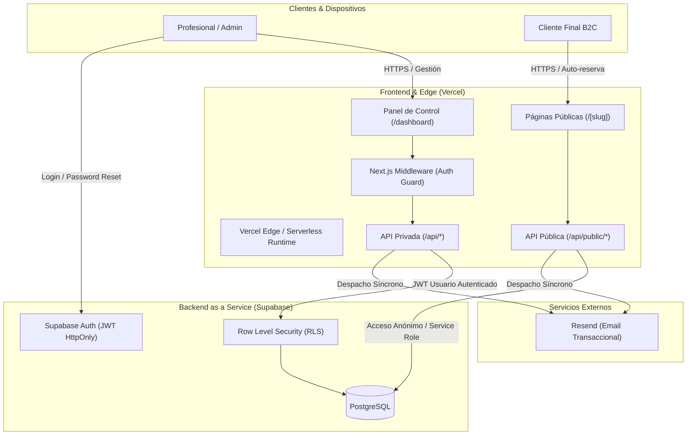
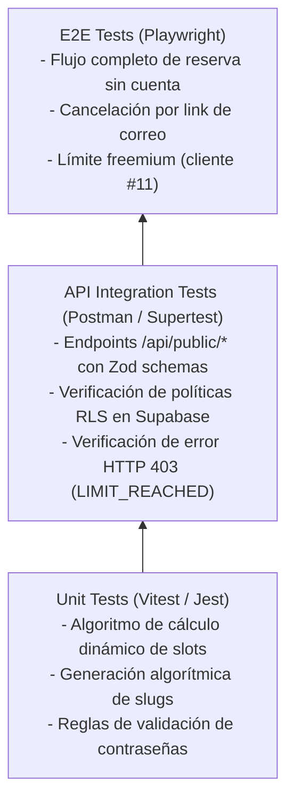

# Diseño del Sistema y Arquitectura: CITA AI

## 1. Stack Tecnológico

| Capa | Tecnología | Justificación / Estado Actual |
| :--- | :--- | :--- |
| **Frontend** | **Next.js (App Router) + React** | Framework fullstack renderizado en servidor y cliente; provee enrutamiento dinámico para slugs públicos (`/[slug]`) y panel de administración (`/dashboard`). |
| **Estilos y Componentes** | **Tailwind CSS + Radix UI + Lucide Icons** | Componentes accesibles sin estilos predeterminados (Radix) estilizados con utilidades Tailwind para una interfaz ágil, moderna y responsive. |
| **Validación y Formularios** | **React Hook Form + Zod** | Manejo performante de formularios con tipado e inferencia de esquemas de validación tanto en cliente como en API routes. |
| **Fechas y Horarios** | **date-fns (locale es)** | Manipulación y formateo de fechas en español para el cálculo dinámico de franjas horarias y slots de disponibilidad. |
| **Backend / BaaS** | **Supabase (PostgreSQL + Auth + RLS)** | Base de datos relacional administrada, motor de autenticación JWT y políticas de seguridad a nivel de fila (Row Level Security) sin servidor dedicado propio. |
| **Mensajería Transaccional** | **Resend** | Servicio de despacho de correo electrónico transaccional (bienvenida, confirmación, avisos de cancelación) vía API REST. |
| **Infraestructura & Hosting** | **Vercel** | Plataforma de alojamiento serverless con despliegue continuo automático conectado a la rama `main`. Entorno productivo único en `https://cita-ai.vercel.app/`. |

---

## 2. Diagrama de Arquitectura (Mermaid)

---

## 3. Modelo de Datos (Esquema PostgreSQL en Supabase)

El sistema opera sobre cinco tablas principales en el esquema `public`:

*   **`professionals`:** Extiende `auth.users` vinculándose mediante clave foránea en `id`.
    *   *Campos:* `id` (UUID, PK/FK `auth.users`), `name` (TEXT), `email` (TEXT), `slug` (TEXT, Unique), `appointment_duration_minutes` (INTEGER), `created_at` (TIMESTAMPTZ).
*   **`clients`:** Almacén de clientes finales.
    *   *Campos:* `id` (UUID, PK), `name` (TEXT), `email` (TEXT, Unique Global), `created_at` (TIMESTAMPTZ).
    *   *Nota de diseño:* `email` tiene restricción única global; si un cliente reserva con dos profesionales distintos, comparte la misma entidad cliente.
*   **`appointments`:** Registra los turnos pactados.
    *   *Campos:* `id` (UUID, PK), `professional_id` (UUID, FK `professionals.id`), `client_id` (UUID, FK `clients.id`), `start_time` (TIMESTAMPTZ), `end_time` (TIMESTAMPTZ), `status` (TEXT con CHECK `status IN ('confirmed', 'cancelled')`), `created_at` (TIMESTAMPTZ).
*   **`availability_rules`:** Reglas de horario semanal recurrente.
    *   *Campos:* `id` (UUID, PK), `professional_id` (UUID, FK `professionals.id`), `day_of_week` (INTEGER, 0 = Domingo a 6 = Sábado), `start_time` (TIME), `end_time` (TIME), `created_at` (TIMESTAMPTZ).
*   **`time_blocks`:** Bloqueos puntuales de fechas y horarios.
    *   *Campos:* `id` (UUID, PK), `professional_id` (UUID, FK `professionals.id`), `start_time` (TIMESTAMPTZ), `end_time` (TIMESTAMPTZ), `reason` (TEXT, opcional), `created_at` (TIMESTAMPTZ).

### Relaciones Clave:
*   `professionals` 1:N `availability_rules` (reemplazo total en cada actualización).
*   `professionals` 1:N `time_blocks` (bloqueos de agenda).
*   `professionals` 1:N `appointments` N:1 `clients` (cálculo de clientes únicos por join).

---

## 4. Diseño de Interfaces (APIs)

*   **Estilo de Comunicación:** REST API basada en Next.js Route Handlers (`src/app/api/...`).
*   **Mecanismo de Seguridad:**
    *   Rutas autenticadas: Supabase Auth JWT transportado en cookie `httpOnly` validado por `middleware.ts`.
    *   Rutas públicas: Acceso anónimo validado por esquema Zod; endpoints con mutación privilegiada utilizan cliente administrativo (`service_role`) para eludir RLS en cancelaciones directas.

### Endpoints del Profesional (Requieren Autenticación):
*   `GET /api/appointments`: Listado de turnos agendados del profesional autenticado.
*   `GET /api/clients`: Listado de clientes únicos asociados a turnos del profesional.
*   `PUT /api/professionals/settings`: Actualización de datos de perfil y duración de turno.
*   `POST /api/availability/rules`: Definición y reemplazo completo de la grilla horaria semanal.
*   `GET /api/availability/blocks`: Consulta de bloqueos temporales activos.
*   `POST /api/availability/blocks`: Creación de un nuevo bloqueo puntual de agenda.
*   `DELETE /api/availability/blocks/[id]`: Eliminación de un bloqueo de agenda.
*   `POST /api/appointments/[id]/cancel`: Cancelación de un turno desde el dashboard.

### Endpoints Públicos (Flujo Cliente Final / Sin Sesión):
*   `GET /api/public/availability?slug=[slug]&date=[date]`: Obtiene los slots dinámicos calculados para la semana solicitada.
*   `POST /api/public/appointments`: Crea una nueva reserva (valida límite freemium, disponibilidad y concurrencia).
*   `POST /api/public/appointments/[id]/cancel`: Cancela un turno utilizando el identificador único provisto en el correo de confirmación.

---

## 5. Decisiones de Arquitectura (ADRs)

### ADR-1: Cálculo Dinámico de Slots en Memoria vs. Persistencia Previa
*   **Contexto:** Los turnos disponibles varían constantemente según bloqueos, cancelaciones y reservas confirmadas.
*   **Decisión:** No persistir franjas horarias vacías en base de datos. Se computan dinámicamente en servidor en cada solicitud: `slots_libres = availability_rules - appointments(confirmed) - time_blocks`.
*   **Consecuencias:**
    *   *Positivas:* Flexibilidad total ante cambios de horario del profesional sin necesidad de regenerar registros futuros.
    *   *Negativas:* Sobrecarga de cómputo en consultas recurrentes; no soporta de forma nativa franjas horarias que crucen la medianoche.

### ADR-2: Cancelación Pública vía Service Role vs. Magic Link / OTP
*   **Contexto:** El cliente final no posee cuenta ni credenciales para autenticarse contra Supabase Auth, pero debe poder cancelar su turno.
*   **Decisión:** Exponer `/api/public/appointments/[id]/cancel` ejecutando la mutación con el cliente Supabase `service_role` (omitiendo RLS).
*   **Consecuencias:**
    *   *Positivas:* Flujo de cancelación en un solo clic con fricción cero desde el correo transaccional.
    *   *Negativas:* Riesgo de seguridad si los IDs de turno son secuenciales o predecibles; requiere que los IDs sean UUIDs criptográficamente seguros.

### ADR-3: Validación de Concurrencia en Dos Pasos en Código vs. Transacción Serializada
*   **Contexto:** Dos clientes pueden intentar reservar el mismo slot simultáneamente.
*   **Decisión:** Implementar una verificación de disponibilidad inmediata antes de ejecutar el `INSERT` desde el código del handler.
*   **Consecuencias:**
    *   *Positivas:* Implementación rápida sin escribir stored procedures en PostgreSQL.
    *   *Negativas:* Existe una ventana milimétrica de condición de carrera (*race condition*); requiere migrar a una función atómica en PostgreSQL (`SELECT ... FOR UPDATE`).

### ADR-4: Monolito Serverless con Entorno Único Productivo
*   **Contexto:** Velocidad de entrega y mantenimiento por un único desarrollador.
*   **Decisión:** Centralizar frontend, BFF y APIs en Next.js alojado en Vercel, operando sobre un único proyecto productivo.
*   **Consecuencias:**
    *   *Positivas:* Simplicidad de despliegue continuo sin sobrecarga de infraestructura.
    *   *Negativas:* Falta de ambiente de staging/UAT para pruebas de regresión y QA sin impacto en datos reales.

---

## 6. Estrategia de Testing (Shift-Left)

Dado que el estado actual del repositorio carece de pruebas automatizadas de cualquier tipo (`0 tests`), se establece la siguiente estrategia de aseguramiento de calidad:

1.  **Nivel Unitario (Prioridad 1):**
    *   Pruebas sobre el algoritmo de generación de slots (`availability.ts`) con diversas combinaciones de disponibilidad, bloqueos y solapamientos.
    *   Validaciones de esquemas Zod y lógica de cálculo del límite freemium (`freemium.ts`).
2.  **Nivel de Integración de API (Prioridad 2):**
    *   Validación de endpoints públicos y autenticados verificando que las políticas RLS restrinjan el acceso entre profesionales distintos.
    *   Pruebas de concurrencia simulada sobre el endpoint `POST /api/public/appointments`.
3.  **Nivel End-to-End (E2E) con Playwright (Prioridad 3):**
    *   Mapeo de los Happy Paths: Onboarding del profesional, auto-reserva del cliente en 30 segundos y cancelación unilateral.
    *   Validación de mensajes de error de colisión (*"¡Casi! Parece que alguien más..."*) y bloqueo al cliente 11.

---

## 7. Análisis de Deuda Técnica

*   **TypeScript en modo permisivo:** `tsconfig.json` está configurado con `strict: false`, ocultando posibles errores de tipado en producción.
*   **Falta de migraciones versionadas y scripts de seed:** El esquema de base de datos se administra manualmente en la consola web de Supabase; no existe control de versiones de DDL ni recuperación automática ante desastres.
*   **Despacho síncrono de correos:** El envío de emails transaccionales se procesa dentro del ciclo de vida de la petición HTTP, ralentizando la respuesta al cliente final si Resend presenta latencia.
*   **Ausencia de tareas programadas (cron):** La falta de un plan con cron en Vercel bloquea la implementación de los recordatorios automáticos 24 horas antes del turno.
*   **Falta de índice en appointments para freemium:** La consulta de conteo de clientes únicos por profesional no está indexada, lo que degradará el rendimiento al crecer la tabla de turnos.

---

## Fuentes

| Dato / afirmación técnica | De dónde sale |
| :--- | :--- |
| Stack tecnológico (Next.js, Supabase, Tailwind, Radix, Resend, Vercel) | `04-notas-tecnicas.md` · stack / `05-hilo-mail-cambio-de-alcance.md` |
| Esquema de las 5 tablas y tipos de datos en PostgreSQL | `04-notas-tecnicas.md` · tablas |
| Políticas RLS y uso de cliente administrativo `service_role` en cancelaciones | `04-notas-tecnicas.md` · row level security / endpoints |
| Algoritmo de cálculo dinámico de slots semanales | `04-notas-tecnicas.md` · los slots |
| Límite hardcodeado `FREE_PLAN_CLIENT_LIMIT = 10` y código 403 `LIMIT_REACHED` | `04-notas-tecnicas.md` · limite del plan gratuito |
| Inexistencia de tests de software en el proyecto actual | `04-notas-tecnicas.md` · lo que no esta hecho |
| Entorno único en producción `https://cita-ai.vercel.app/` sin UAT activo | `documentacion para QA/nota-ambientes-y-accesos.md` · lo del ambiente de UAT |
| Restricción de 15 min JWT / 7 días refresh token / 1 hora reset PKCE | `04-notas-tecnicas.md` · auth |
| Arquitectura de colas / workers asíncronos para emails futuros | **Hipótesis** — recomendación de arquitectura para mitigar latencia |
| Implementación de stored procedure con `SELECT ... FOR UPDATE` | **Hipótesis** — propuesta técnica para resolver la condición de carrera |

---

## Contradicciones detectadas

*   **Existencia de ambiente UAT vs. Producción única:** `04-notas-tecnicas.md` documenta dos ambientes separados con bases de datos independientes (`uat.cita.ai` y `cita.ai`). Sin embargo, `nota-ambientes-y-accesos.md` confirma que UAT fue abandonado y la plataforma corre en un solo entorno productivo (`cita-ai.vercel.app`). Se adopta la realidad de producción única.
*   **Proveedor de correo transaccional:** `04-notas-tecnicas.md` señalaba el servicio de correo nativo de Supabase, mientras que `05-hilo-mail-cambio-de-alcance.md` documentó la migración a Resend. Se consolida Resend.
*   **Manejo de zonas horarias:** `04-notas-tecnicas.md` declaraba que no se controlaban husos horarios; la reunión del 19/05/2026 y los tickets de soporte confirmaron la aplicación de una corrección técnica en abril de 2026 para clientes internacionales.

---

## Preguntas abiertas

*   ¿Qué solución de cron jobs (Vercel Cron / Upstash / QStash) se adoptará para habilitar el despacho de recordatorios automáticos del día anterior?
*   ¿Cuándo se migrará el esquema de base de datos a scripts de migración formales (Supabase CLI / Flyway / Prisma Migrate)?
*   ¿Qué mecanismo de protección contra denegación de servicio o abuso por fuerza bruta (Rate Limiting vía Upstash Redis / Cloudflare) se integrará en `/api/public/*`?
*   ¿Cómo se rediseñará la tabla `clients` y `professionals` para dar soporte a múltiples colaboradores o sedes (caso redes de consultorios) sin romper la unicidad de email?
